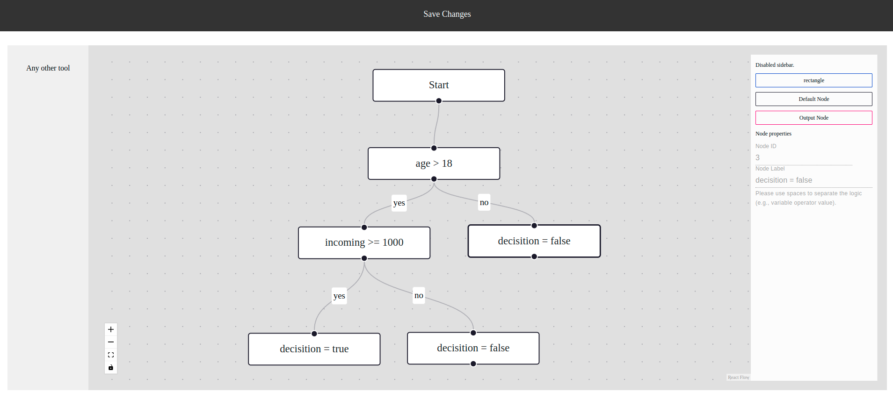

# Decision Engine

## Table of Contents

- [Introduction](#introduction)
- [System Overview](#system-overview)
- [Functional Requirements](#functional-requirements)
- [Non-Functional Requirements](#non-functional-requirements)
- [Getting Started](#getting-started)
  - [Prerequisites](#prerequisites)
  - [Installation](#installation)
- [Usage](#usage)
  - [ConfigFrontend](#configfrontend)
  - [ConfigBackend](#configbackend)
  - [Policy DB](#policy-db)
  - [ExecutionEngine](#executionengine)
- [Testing](#testing)
- [Error Handling](#error-handling)
- [Contributing](#contributing)
- [License](#license)

## Introduction

The Decision Engine is a software system that allows non-technical users to design decision policies and put them into production without the need for a programmer. This README provides an overview of the system, its components, and how to set it up and use it.

## System Overview

The Decision Engine comprises four main components:

- **ConfigFrontend**: This component was built in React and allows users to design decision policies using a drag-and-drop interface. Some libraries, such as React-Flow, were used to implement the drag-and-drop feature. Unfortunately, I was unable to implement interactivity in the front-end due to my lack of experience with these libraries. As a result, the front-end is static.

- **ConfigBackend**: Responsible for managing the policies created in ConfigFrontend. It was built in Python and provides CRUD operations, including READ and UPDATE in this project. It communicates with the Policy DB to store and retrieve policies.

- **Policy DB**: This component stores policies created in ConfigFrontend. A CSV file was used as a pseudo-database.

- **ExecutionEngine**: It is the "main" in this system. It provides an API for executing the previously configured policies. When changes are made to policies through ConfigFrontend,

## Functional Requirements

### ConfigFrontend

- Allows users to design decision policies using drag and drop with three components: START, decision blocks, and END.
- Decision blocks must have three configurations: which input variable to operate on, the comparison criteria (=, <, <=, >=, or >), and the value to compare the variable with.
- END blocks have a single configuration, setting the value of the 'decision' output to True or False.
- Supports only one type of decision policy (no editing of multiple policies).

### ConfigBackend

- Implements CRUD operations for the policies designed in ConfigFrontend, including READ and UPDATE.
- Utilizes REST for communication.
- Can use any technology but Python is preferred.

### Policy DB

- Utilizes a preferred database system or file storage to store policies designed in ConfigFrontend.

### ExecutionEngine

- Provides a REST API for executing previously configured policies.
- Can use any technology but Python is preferred.
- Ensures that modifications to policies via ConfigFrontend take effect within 10 seconds.

## Non-Functional Requirements

- All components should be placed in the same GitHub repository.
- Code, comments, and UI elements should be in English.
- Code should be clean and well-documented to facilitate understanding for others.
- Unit tests for both the backend and frontend are required.
- Error handling should be implemented in all backends, and frontend should display error messages from the backend.
- Commits should be small with descriptive messages.
- A detailed README explaining the solution and how to set it up should be provided.

## Getting Started

### Prerequisites

Make sure you have the following software installed on your system:

- [Node.js v20.6.1](https://nodejs.org/)
- [Python v3.8.5](https://www.python.org/)

### Installation

After cloning the repository, you need to perform the following steps:

In the root of the repository, open 2 terminals to start two services, one for the front-end and another one for the back-end.

a. In the front-end terminal, run the command **npm run start-frontend**. This command will install all the necessary dependencies and start the localhost server.

b. In the back-end terminal, run the command npm **run start-backend**. This command will also install all the required dependencies and start the localhost server.

## Usage

### ConfigFrontend

This screen is designed for the person in charge to update and manage policy rules. It's supposed to be dynamic. However, at this stage of the project, it's static and serves only as a representation of this action.

After "making changes" to the policy, you must click the "Save Changes" button to update the policy database through an API.

### ConfigBackend

This section of the system encompasses all the backend functionalities.

### Policy DB

This is a pseudo-database in CSV format designed to store the rules created in the configFrontend.

### ExecutionEngine

This is the main file in configBackend, housing the routers that facilitate communication throughout the APIs.

## Testing

Tests in the back-end were developed using the unittest framework.

However, tests in the front-end have not been completed.

## License

This project is licensed under the MIT License - see the [LICENSE](LICENSE) file for details.

### MIT License

MIT License

Copyright (c) 2023 Heloísa Gabriela Vieira

Permission is hereby granted, free of charge, to any person obtaining a copy
of this software and associated documentation files (the "Software"), to deal
in the Software without restriction, including without limitation the rights
to use, copy, modify, merge, publish, distribute, sublicense, and/or sell
copies of the Software, and to permit persons to whom the Software is
furnished to do so, subject to the following conditions:

The above copyright notice and this permission notice shall be included in all
copies or substantial portions of the Software.

THE SOFTWARE IS PROVIDED "AS IS," WITHOUT WARRANTY OF ANY KIND, EXPRESS OR
IMPLIED, INCLUDING BUT NOT LIMITED TO THE WARRANTIES OF MERCHANTABILITY,
FITNESS FOR A PARTICULAR PURPOSE AND NONINFRINGEMENT. IN NO EVENT SHALL THE
AUTHORS OR COPYRIGHT HOLDERS BE LIABLE FOR ANY CLAIM, DAMAGES OR OTHER
LIABILITY, WHETHER IN AN ACTION OF CONTRACT, TORT OR OTHERWISE, ARISING FROM,
OUT OF OR IN CONNECTION WITH THE SOFTWARE OR THE USE OR OTHER DEALINGS IN THE
SOFTWARE.
